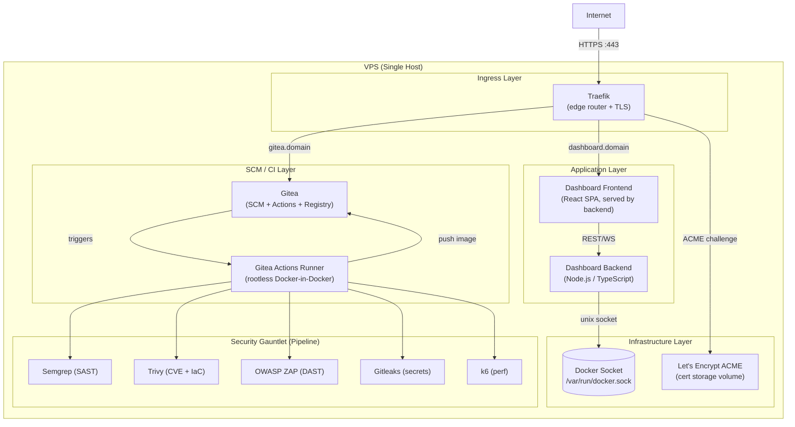

# VPS Self-Hosted DevOps Platform — Architecture

## 1. Overview

This document describes the architecture of a fully self-hosted DevOps platform running on a single VPS. The platform provides source control, CI/CD pipelines, container image registry, TLS-terminated ingress, and a custom operations dashboard — all at zero recurring cloud cost.

Approver: **Helmwill**
Confirmed: 2026-03-12

---

## 2. Tech Stack

| Concern | Chosen Technology | Key Reason |
|---|---|---|
| Source control | Gitea | Self-hosted, Git-compatible, built-in registry and Actions |
| CI/CD | Gitea Actions | Native to Gitea, GitHub Actions YAML-compatible |
| Container registry | Gitea built-in OCI registry | Co-located with SCM, no additional service |
| Reverse proxy / TLS | Traefik v3 | Docker-native label routing, automatic Let's Encrypt |
| Infrastructure as Code | Docker Compose | Single-file declarative stacks, no orchestrator required |
| Dashboard backend | Node.js 20 LTS (TypeScript) | Lightweight, native Docker SDK support |
| Dashboard frontend | React (TypeScript) | Component model suits real-time stat widgets |
| SAST | Semgrep | OSS, multi-language, rule packs for TS/Docker/IaC |
| CVE + IaC scan | Trivy | Scans images, Compose files, and Dockerfiles in one tool |
| DAST | OWASP ZAP | Industry standard, automation-friendly baseline scan |
| Credential detection | Gitleaks | Git-history aware, runs pre-push and in pipeline |
| Secret storage | Gitea Actions secret store | Secrets never leave the VPS; no third-party vault |
| Performance testing | k6 | Scriptable, p99 latency assertions in CI |

### 2.1 Alternatives Considered

#### Reverse Proxy
- **Nginx Proxy Manager** — GUI-driven, but routing rules are not code-reviewable; no native Docker label support.
- **Caddy** — Excellent automatic TLS, but Traefik's Docker provider and middleware ecosystem is better suited to dynamic container-label routing.
- **HAProxy** — High performance but requires manual TLS configuration; no native container discovery.

#### CI/CD
- **Jenkins** — Mature but heavy JVM footprint; plugin maintenance burden on a single VPS.
- **Drone CI** — Minimal resource use, but a separate product and community; Gitea Actions reuses the same SCM event bus.
- **GitHub Actions (hosted)** — Requires outbound runner registration and exposes code to GitHub infrastructure; violates zero-cloud constraint.

#### Container Orchestration / IaC
- **Kubernetes (k3s)** — Adds etcd, control-plane overhead, and operational complexity disproportionate to a single-node VPS.
- **Nomad** — Lighter than Kubernetes but still a separate scheduler; Docker Compose is already understood by the team and sufficient for this workload.
- **Ansible** — Imperative playbooks are harder to diff and review than Compose YAML; better suited to multi-host provisioning.

#### Dashboard Backend
- **Go** — Slightly lower memory footprint; however, Node.js 20 shares the TypeScript language with the frontend, reducing cognitive context-switching.
- **Python / FastAPI** — Viable, but the Docker SDK for Node.js is first-class and the team's primary language is TypeScript.

#### SAST
- **SonarQube** — Requires a persistent database and JVM; Semgrep runs as a stateless CLI in CI with no server.
- **Bandit / ESLint security plugin** — Language-specific; Semgrep covers TypeScript, Dockerfiles, and IaC in a single invocation.

---

## 3. Component Diagram



---

## 4. Environment Model

| Environment | Trigger | Lifecycle | Approval Gate |
|---|---|---|---|
| dev | Push to feature branch | Ephemeral — torn down after branch merge | None |
| qa | PR opened against main | Ephemeral — torn down after merge to main | None |
| prod | Merge to main | Persistent | Manual approval by Helmwill |

**Deployment model:** Build once in dev (image tagged with Git SHA / OCI digest). Promote the same immutable image digest to QA, then to prod. No rebuild at promotion.

---

## 5. CI/CD Pipeline Stages (Security Gauntlet)

```
T1 — Unit + Integration Tests   (>=80% coverage; hard block on failure)
T2 — SAST (Semgrep)             (CRITICAL/HIGH findings = hard block)
T3 — IaC Scan (Trivy)           (Compose files + Dockerfiles; HIGH = hard block)
T4 — DAST + Perf (ZAP + k6)    (against live QA slot; HIGH/CRIT = hard block; p99 < 500 ms)
T5 — Policy Gate (Trivy CVE + Gitleaks)  (final sign-off before prod promotion)
```

Gates T1–T5 are mandatory. No stage may be skipped without a written human waiver recorded in `docs/execution-log.json`.

---

## 6. Data Flow

### 6.1 Inbound Request (end-user to dashboard)

```
Browser
  → HTTPS :443 → Traefik (SNI routing on dashboard.domain)
  → HTTP → Dashboard Backend (Node.js container, internal network)
  → Docker Socket (Unix socket, read+control)
  → JSON response → Dashboard Frontend (React SPA)
```

### 6.2 CI/CD Push Flow

```
Developer git push
  → Gitea webhook → Gitea Actions Runner
  → T1: npm test (unit + integration)
  → T2: semgrep scan (source + IaC)
  → T3: trivy fs (Dockerfiles + Compose)
  → docker build → tag with SHA → push to Gitea Registry
  → deploy to QA slot (docker compose up)
  → T4: zap-baseline.py against QA URL + k6 run
  → T5: trivy image (published digest) + gitleaks detect
  → [AWAITING_HUMAN_APPROVAL — Helmwill]
  → deploy to prod (same image digest, compose up)
```

### 6.3 Secret Handling

Secrets (TLS email, registry credentials, basic-auth password hash) are stored exclusively in the Gitea Actions secret store. They are injected as environment variables at runtime and are never written to files, logs, or image layers. Any agent that encounters a credential in context must halt with `CREDENTIAL_LEAKED`.

---

## 7. API Contracts

### 7.1 Dashboard Backend REST API

All endpoints are internal (not publicly routed). Traefik terminates TLS and proxies to the backend on the internal Docker network.

| Method | Path | Description | Auth |
|---|---|---|---|
| GET | `/api/health` | Liveness probe | None |
| GET | `/api/containers` | List all containers with status, CPU %, mem usage | Basic Auth |
| POST | `/api/containers/:id/start` | Start a stopped container | Basic Auth |
| POST | `/api/containers/:id/stop` | Stop a running container | Basic Auth |
| POST | `/api/containers/:id/restart` | Restart a container | Basic Auth |
| GET | `/api/system` | Server uptime, disk free, RAM free, server time | Basic Auth |

All responses are `application/json`. Container control endpoints return `{ "ok": true }` or `{ "ok": false, "error": "<message>" }`.

### 7.2 Docker Socket Access

The backend communicates with the Docker daemon via the Unix socket at `/var/run/docker.sock` using the official Docker Engine API (v1.43+). The socket is mounted read+write into the dashboard backend container only. No other application container has socket access.

### 7.3 Traefik Dynamic Configuration

Service discovery is label-driven. Each Compose service declares:

```
traefik.enable=true
traefik.http.routers.<name>.rule=Host(`<subdomain>.domain`)
traefik.http.routers.<name>.entrypoints=websecure
traefik.http.routers.<name>.tls.certresolver=letsencrypt
traefik.http.middlewares.<name>-auth.basicauth.users=<hashed>
```

---

## 8. Non-Functional Requirements

| Category | Requirement |
|---|---|
| Availability | Single-node; no HA guarantee. Platform-level SLA defers to VPS provider uptime. |
| TLS | All public-facing routes HTTPS only. Traefik redirects :80 to :443. Certificates auto-renewed via ACME. |
| Authentication | Dashboard protected by basic auth (bcrypt hashed credentials). Gitea uses its own user/token auth. |
| Authorisation | Dashboard has no role model; any authenticated user has full container control. |
| Performance | Dashboard API p99 < 500 ms under normal load (enforced by k6 in T4). |
| Security scanning | All five gauntlet gates run on every PR. CRITICAL/HIGH findings are hard blocks; cannot be auto-suppressed. |
| Secret hygiene | No credential in any image layer, log line, compose file, or agent context. Gitleaks runs on full git history at T5. |
| Budget | $0/month cloud spend. All tooling is OSS. |
| Maintainability | All infrastructure described in Docker Compose files, code-reviewed via PRs. No manual server changes outside of compose operations. |
| Observability | Container metrics exposed via dashboard. No external APM or log aggregation in scope (v1). |
| Agent concurrency | Default 2 parallel agent tasks; maximum 5. Three gauntlet failures on the same story triggers `NEEDS_HUMAN` state. |
